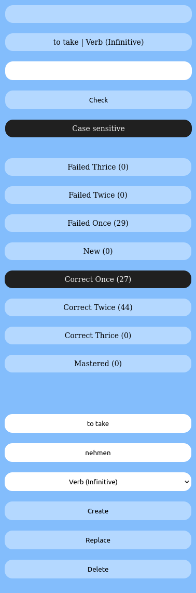
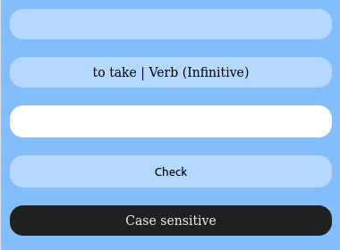
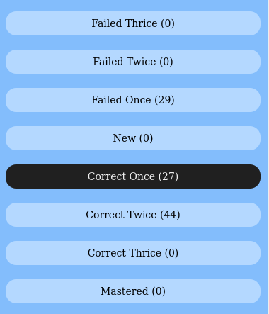
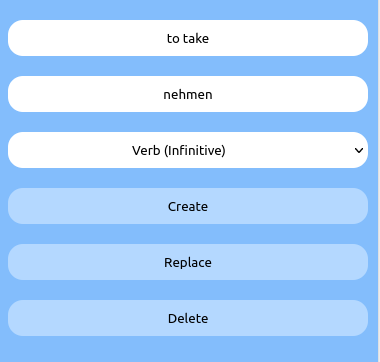

# Flashy - Yet another simple vocabulary trainer

This is a single-file php application for training writing using flash cards sorted into boxes.
The UI is optimized for mobile viewing. Added cards are automatically sorted into different boxes based on successfully typing in the correct answer or not.

The provided database contains cards for learning German for english speakers but it can be adapted to learn anything. Editing of words is also possible throug the UI adding an empty database is also an option. To change the flow of boxes, add/remove boxes or add/remove word classes, please tweak db.sql before creating the sqlite3 database.

## Why build it?
I wrote this small application to help my wife learn german but then thought of publishing it in case someone else is looking for a simple solution. I know there are plenty of language learning programs out there but i wanted something offline and with boxes the cards are sorted into the traditional way. Contributions and improvements are most welcome.

## Screenshots


### Test


### Vocabulary Boxes


### Editor



## Requirements

- php 5.0 or higher
- php-sqlite3 extension

## Installation
1. Set a password for your new user in username.sql. Find following line and replace '5e884898da28047151d0e56f8dc6292773603d0d6aabbdd62a11ef721d1542d8' by the sha256 hash of your preferred password.
```
INSERT INTO config VALUES(1,'PASSWORD','password');
```

Create a database from the provided username.sql file. Note that the filename without the '.db' determines the login username.
```
sqlite yourloginuser.db < username.sql
```


You can also disable authentication by removing the '//' part of following lines at the bottom of index.php
```
//$db = new DB('username.db');
//new App($db);
```

And adding '//' to the start of the following lines at the same spot in index.php
```
$auth = new Auth();
new App($auth->getDBHandle());
```


```
new Auth($db);
```
at the bottom of index.php to disable basic authentication completely.

